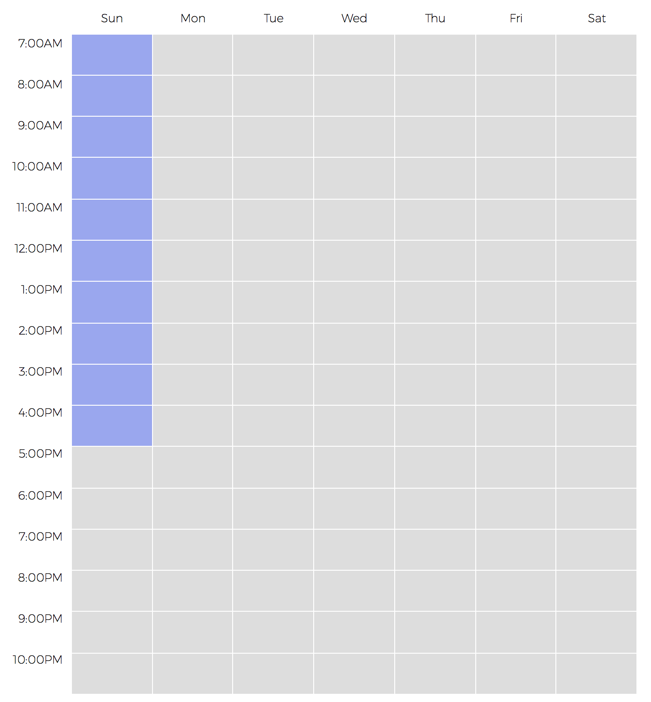
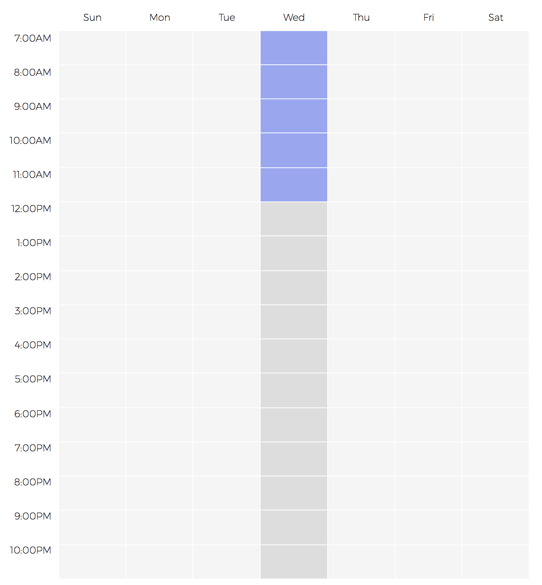

# Weekly Scheduler

I created this mini-project as a component to be used with my academic scheduling application.

Many of the javascript weekly schedule components that I found were expensive and has features that I did not need at all. So I decided to build my own minimalistic and interactive scheduling component.

I wanted to make it customizable as well so I will be adding features to initialize the component using various options.

## Screen shots
It supports user selection



When the user clicks on a specific day, the entire day container will be focused.



## Installation
Installation is very simple!
You will need to have jQuery loaded on the html file. If you do not care to read through the source code, simply download the jquery.weekly-schedule-plugin.min.js and insert it to the html file after jQuery.

```html
<html>
    <head>
        <script src="https://code.jquery.com/jquery-3.1.1.min.js"></script>
        <script src="jquery.weekly-schedule-plugin.min.js"></script>
    </head>
</html>
```

## Use
In order to make use of this tool, you will need to initialize the component.
Make sure to create a div with a unique ID ('target' in my example below). Then simply make a jQuery call to initialize the component in that div.

```html
<html>
    <head>
        <script src="https://code.jquery.com/jquery-3.1.1.min.js"></script>
        <script src="jquery.weekly-schedule-plugin.min.js"></script>
    </head>
    <body>
        <div class="container" style="margin: auto; width: 50%; height: 100%; display: flex; flex-direction: row; justify-content: center;">
            <div id="target">
            </div>
        </div>
        <script>
            $('#target').weekly_schedule();
        </script>
    </body>
</html>
```

This component has various options that you can utilize to customize the component. Below is the default setting.

```javascript
var settings = {
    days: ["sun", "mon", "tue", "wed", "thu", "fri", "sat"], // Days displayed
    hours: "7:00AM-10:00PM", // Hours displyed
    fontFamily: "Montserrat", // Font used in the component
    fontColor: "black", // Font colot used in the component
    fontWeight: "100", // Font weight used in the component
    fontSize: "0.8em", // Font size used in the component
    hoverColor: "#727bad", // Background color when hovered
    selectionColor: "#9aa7ee", // Background color when selected
    headerBackgroundColor: "transparent", // Background color of headers
}
```

I will be adding more customization options soon but those are the options I needed for my personal project...

In order to initialize the component with customized settings, simply insert the object as an argument:

```javascript
var mySettings = {
    hoverColor: "red";
    selectionColor: "pink"
}

$('#target').weekly_schedule(mySettings);
```

In order to retrieve selected hours, call the same function you used to initialize the component but in the argument enter the appropriate function name.

Currently the only function you can run is:
- "getSelectedHour"
    - This function will return a javascript object of all hours that has been selected by the user broken up according to the days.

```javascript
    $('#target').weekly_schedule("getSelectedHour");
    // Will return an object
```
