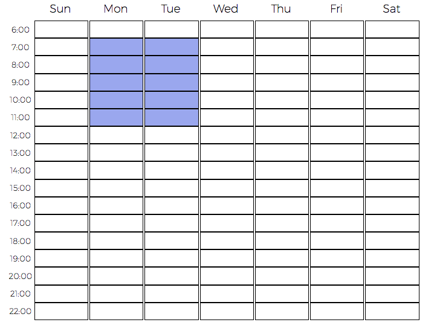
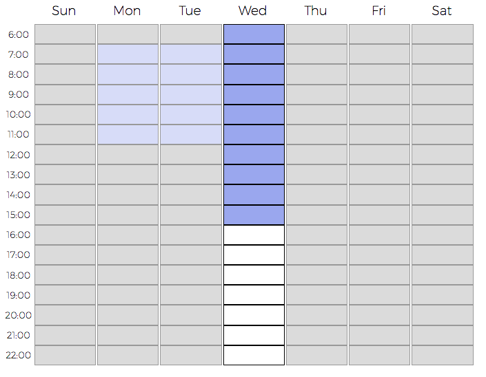

# Weekly Scheduler

I created this mini-project as a component to be used with my academic scheduling application.

Many of the javascript weekly schedule components that I found were expensive and has features that I did not need at all. So I decided to build my own minimalistic and interactive scheduling component.

I wanted to make it customizable as well so I will be adding features to initialize the component using various options.

## Screen shots
It supports user selection

When the user clicks on a specific day, the entire day container will be focused.

## To-Do
1. Add features to retrieve selected hours
2. Add features to customize through option parameters
3. Turn this mini-project into a single minified javascript file so that it can easily be imported and initialized in other html files.
